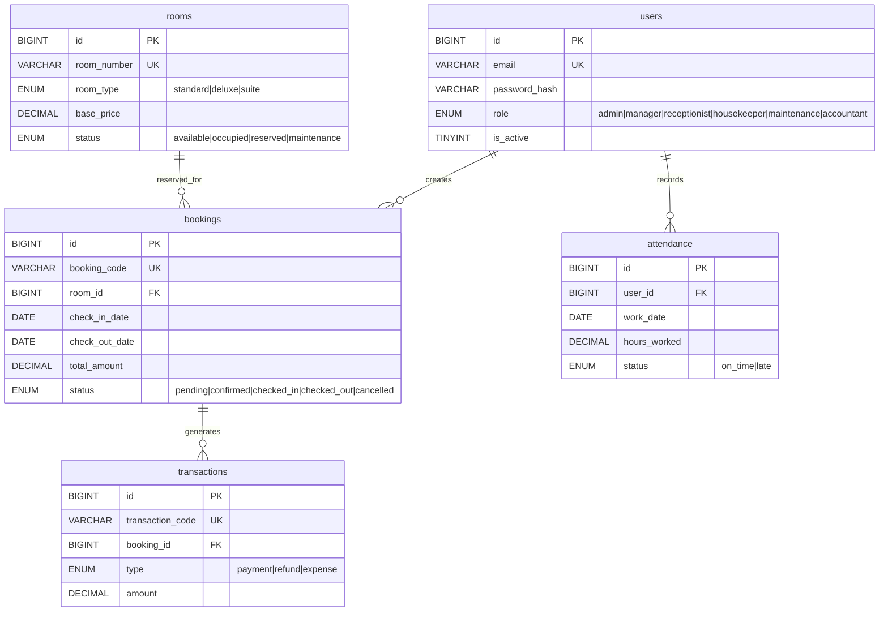

# 🏨 Hotel Brunelleschi — Enterprise Hotel Management System

> **Full-stack hotel management platform** built with **React 19 · Express 5 · MySQL 8** featuring dark-glass enterprise UI, custom SVG branding, layered backend architecture, Zod validation, JWT RBAC, environment-based config, and Docker-ready deployment.

<p align="center">
  
  
  
  
  
  
  
</p>

---

## ⚡ Highlights

- **Enterprise Backend Architecture** — Service Layer → Controller → Route pattern with centralized error handling and standardized API responses
- **Input Validation Pipeline** — Zod schemas on every mutating endpoint, parsed before reaching handlers
- **JWT + RBAC** — 6-role access control (Admin, Manager, Receptionist, Housekeeper, Maintenance, Accountant) with route-level guards
- **Dark Enterprise UI** — Glassmorphism design system with indigo/cyan accent gradients, micro-animations, and responsive layouts
- **Production-Ready** — Rate limiting, Helmet security headers, CORS config, structured Winston logging, graceful shutdown, Docker Compose
- **Guest Booking Flow** — Public booking without registration via booking code + phone verification

---

## 🖥 Tech Stack

### Frontend

| Technology | Version | Purpose |
|:-----------|:--------|:--------|
| React | 19 | UI framework with hooks & functional components |
| TypeScript | 5 | Static type safety across all components |
| Vite | 7 | Sub-second HMR dev server & optimized builds |
| TailwindCSS | 3 | Utility-first styling with custom design tokens |
| React Router | 7 | Declarative client-side routing with guards |
| Recharts | 2 | Composable chart library for dashboards |
| Framer Motion | — | Smooth layout & page transition animations |
| Lucide React | — | Consistent icon system |

### Backend

| Technology | Version | Purpose |
|:-----------|:--------|:--------|
| Node.js | 20+ | Runtime environment |
| Express | 5 | HTTP framework with async middleware support |
| MySQL 2 | 3 | Prepared-statement database driver |
| Zod | 4 | Schema-first request validation |
| JWT | 9 | Stateless authentication tokens |
| bcrypt | 6 | Adaptive password hashing (cost=10) |
| Winston | 3 | Structured JSON logging with request ID tracking |
| Helmet | 8 | Security HTTP headers |
| express-rate-limit | 7 | Brute-force & DDoS mitigation |

### Infrastructure

| Tool | Purpose |
|:-----|:--------|
| Docker + Compose | One-command deployment (MySQL + API + Nginx) |
| Nginx | Reverse proxy + SPA routing in production |
| dotenv | Environment-based configuration |
| nodemon | Auto-restart during development |

---

## 🏗 Architecture

```
                   ┌──────────────────────────────────────────────────────┐
                   │                   CLIENT (React 19)                  │
                   │  TailwindCSS · TypeScript · Recharts · Glassmorphism │
                   └──────────────────────┬───────────────────────────────┘
                                          │ REST API (JSON)
                   ┌──────────────────────▼───────────────────────────────┐
                   │                   SERVER (Express 5)                  │
                   │                                                      │
                   │  ┌─────────┐  ┌──────────┐  ┌──────────────────┐    │
                   │  │ Helmet  │  │   CORS   │  │  Rate Limiter    │    │
                   │  └────┬────┘  └────┬─────┘  └───────┬──────────┘    │
                   │       └────────────┼────────────────┘               │
                   │                    ▼                                 │
                   │  ┌─────────────────────────────────┐                │
                   │  │  Request ID · Winston Logger     │                │
                   │  └────────────────┬────────────────┘                │
                   │                   ▼                                  │
                   │  ┌────────────────────────────────┐                 │
                   │  │  Routes + Zod Validation        │                 │
                   │  └────────────────┬───────────────┘                 │
                   │                   ▼                                  │
                   │  ┌────────────────────────────────┐                 │
                   │  │  JWT Auth + RBAC Middleware      │                 │
                   │  └────────────────┬───────────────┘                 │
                   │                   ▼                                  │
                   │  ┌────────────────────────────────┐                 │
                   │  │  Controllers (thin handlers)    │                 │
                   │  │  asyncHandler → apiResponse     │                 │
                   │  └────────────────┬───────────────┘                 │
                   │                   ▼                                  │
                   │  ┌────────────────────────────────┐                 │
                   │  │  Service Layer (business logic) │                 │
                   │  │  AppError throws → errorHandler │                 │
                   │  └────────────────┬───────────────┘                 │
                   │                   │                                  │
                   └───────────────────┼──────────────────────────────────┘
                                       ▼
                   ┌──────────────────────────────────────────────────────┐
                   │              MySQL 8 (InnoDB + FK + Indexes)         │
                   └──────────────────────────────────────────────────────┘
```

### Backend Patterns

| Pattern | Implementation |
|:--------|:---------------|
| Service Layer | Business logic isolated in `services/` — DB access, transactions, validation |
| Thin Controllers | ~10-30 lines each, only extract params and call services |
| Centralized Error Handling | `AppError` hierarchy → `asyncHandler` → `errorHandler` middleware |
| Standardized Responses | `apiResponse.success()` / `.created()` / `.paginated()` everywhere |
| Request Validation | Zod schemas in `validators/`, enforced via `validate()` middleware |
| Request Tracing | UUID `requestId` injected on every request, logged with Winston |

---

## 📁 Project Structure

```
myhotel/
├── client/                          # Frontend (React 19 + TypeScript + Vite)
│   ├── public/
│   │   └── logo.svg                 # Hotel Brunelleschi SVG logo (favicon + brand)
│   ├── src/
│   │   ├── components/
│   │   │   ├── ui/                  # Design system (Button, Card, Modal, Badge, etc.)
│   │   │   ├── HotelLogo.tsx        # Reusable SVG logo component
│   │   │   ├── Sidebar.tsx          # Collapsible admin sidebar
│   │   │   └── ClockWidget.tsx      # Staff attendance clock
│   │   ├── layouts/
│   │   │   └── AdminLayout.tsx      # Admin shell with sidebar + content area
│   │   ├── pages/
│   │   │   ├── client/              # Public pages (CustomerHome, GuestBooking, etc.)
│   │   │   ├── Dashboard.tsx        # KPI cards + revenue chart
│   │   │   ├── RoomManagement.tsx   # Room CRUD with modal forms
│   │   │   ├── RoomCalendar.tsx     # Gantt-style booking calendar
│   │   │   ├── Booking.tsx          # Booking management with status flow
│   │   │   ├── Staff.tsx            # Staff management (admin only)
│   │   │   ├── FinancialReport.tsx  # Revenue vs expense charts
│   │   │   └── ...
│   │   ├── lib/
│   │   │   └── api.ts               # Axios instance with interceptors
│   │   ├── services/                # API client layer (uses VITE_API_URL env)
│   │   └── types/                   # Shared TypeScript interfaces
│   ├── .env                         # VITE_API_URL (not committed)
│   ├── .env.example                 # Environment template for team
│   ├── Dockerfile                   # Multi-stage build (Node → Nginx)
│   └── nginx.conf                   # SPA routing + API proxy
│
├── server/                          # Backend (Express 5 + MySQL)
│   ├── src/
│   │   ├── config/
│   │   │   ├── db.js                # MySQL connection pool
│   │   │   └── logger.js            # Winston structured logger
│   │   ├── middleware/
│   │   │   ├── authMiddleware.js    # JWT verification
│   │   │   ├── adminOnlyMiddleware.js
│   │   │   ├── errorHandler.js      # Global error → JSON response
│   │   │   ├── rateLimiter.js       # 100/min general, 10/min auth
│   │   │   ├── requestId.js         # UUID per request
│   │   │   └── validate.js          # Zod schema enforcement
│   │   ├── validators/              # Zod schemas (auth, booking, room, etc.)
│   │   ├── controllers/             # Thin async handlers
│   │   ├── services/                # Business logic + DB queries
│   │   ├── routes/                  # Express routers with validation
│   │   └── utils/                   # AppError, asyncHandler, apiResponse, pagination
│   ├── seed.js                      # Demo data seeder
│   ├── database_schema.sql          # Full DDL with indexes + FK
│   ├── Dockerfile                   # Node 20 Alpine production image
│   └── .env.example                 # Environment variable template
│
├── docker-compose.yml               # MySQL + Server + Client (one command)
└── README.md
```

---

## 🗄 Database Schema

5 tables with foreign keys, composite indexes, and proper constraints:



---

## 🔌 API Reference

### Public (No Authentication)

| Method | Endpoint | Description |
|:-------|:---------|:------------|
| `GET` | `/health` | Health check + uptime + environment |
| `GET` | `/api/public/rooms` | List available rooms |
| `POST` | `/api/public/bookings` | Guest booking (no account needed) |
| `GET` | `/api/bookings/status` | Lookup booking by code + phone |

### Authentication

| Method | Endpoint | Validation | Description |
|:-------|:---------|:-----------|:------------|
| `POST` | `/api/auth/login` | `loginSchema` | Returns JWT token (rate-limited: 10/min) |

### Protected (JWT Required)

| Method | Endpoint | Validation | Description |
|:-------|:---------|:-----------|:------------|
| `GET` | `/api/dashboard` | — | Dashboard KPIs + charts |
| `GET/POST/PUT/DELETE` | `/api/rooms/:id` | `createRoomSchema` · `updateRoomSchema` | Room CRUD |
| `GET/POST` | `/api/bookings` | `createBookingSchema` | Booking management |
| `PUT` | `/api/bookings/:id/status` | `updateBookingStatusSchema` | Status transitions |
| `GET/POST/PUT/DELETE` | `/api/transactions/:id` | `createTransactionSchema` · `updateTransactionSchema` | Financial transactions |
| `GET/POST/DELETE` | `/api/users/staff/:id` | `createUserSchema` | Staff management (Admin only) |
| `GET/POST` | `/api/attendance` | — | Clock in/out + history |
| `GET` | `/api/reports/financial` | — | Monthly P&L report |

---

## 🛡 Role-Based Access Control (RBAC)

| Feature | Admin | Manager | Receptionist | Housekeeper | Maintenance | Accountant |
|:--------|:-----:|:-------:|:------------:|:-----------:|:-----------:|:----------:|
| Dashboard | ✅ | ✅ | ✅ | — | — | — |
| Room Management | ✅ | ✅ | ✅ | — | — | — |
| Room Status | ✅ | ✅ | ✅ | ✅ | ✅ | — |
| Room Calendar | ✅ | ✅ | ✅ | — | — | — |
| Bookings | ✅ | ✅ | ✅ | — | — | — |
| Staff Management | ✅ | ✅ | — | — | — | — |
| Attendance | ✅ | ✅ | ✅ | ✅ | ✅ | — |
| Expenses | ✅ | ✅ | — | — | — | ✅ |
| Transactions | ✅ | ✅ | — | — | — | ✅ |
| Financial Report | ✅ | ✅ | — | — | — | ✅ |

---

## 🚀 Getting Started

### Prerequisites

- **Node.js** ≥ 20 &nbsp;·&nbsp; **MySQL** ≥ 8.0 &nbsp;·&nbsp; **npm** ≥ 9

### Quick Start (Local)

```bash
# 1. Clone
git clone https://github.com/yom1nr/MyHotel.git && cd MyHotel

# 2. Install dependencies
cd server && npm install && cd ../client && npm install && cd ..

# 3. Configure environment
cp server/.env.example server/.env     # Edit JWT_SECRET & DB credentials
cp client/.env.example client/.env     # API URL (default: http://localhost:5000)

# 4. Setup database & seed demo data
mysql -u root -e "CREATE DATABASE IF NOT EXISTS hotel_management_system"
cd server && npm run seed              # Creates tables + demo users/rooms/bookings

# 5. Start both servers
cd server && npm run dev &             # API → http://localhost:5000
cd client && npm run dev &             # UI  → http://localhost:5173
```

**Environment Variables:**
| File | Variable | Default | Description |
|:-----|:---------|:--------|:------------|
| `server/.env` | `PORT` | `5000` | API server port |
| `server/.env` | `DB_HOST` | `localhost` | MySQL host |
| `server/.env` | `JWT_SECRET` | — | **Must change in production** |
| `client/.env` | `VITE_API_URL` | `http://localhost:5000` | Backend API base URL |

**Demo Credentials:**
| Role | Email | Password |
|:-----|:------|:---------|
| Admin | `admin@hotel.com` | `123456` |
| Receptionist | `reception@hotel.com` | `123456` |

### Docker Compose (One Command)

```bash
# Build & run everything (MySQL + API + Nginx)
docker compose up -d

# App available at http://localhost
# API available at http://localhost:5000
```

---

## 📸 Screenshots

### Public — Guest Experience

| Landing Page | Guest Booking | Booking Status |
|:---:|:---:|:---:|
|  |  |  |

### Admin — Management Dashboard

| Dashboard | Room Management | Booking Management |
|:---:|:---:|:---:|
|  |  |  |

| Room Calendar | Financial Report | Transactions |
|:---:|:---:|:---:|
|  |  |  |

---

## 📄 License

MIT
