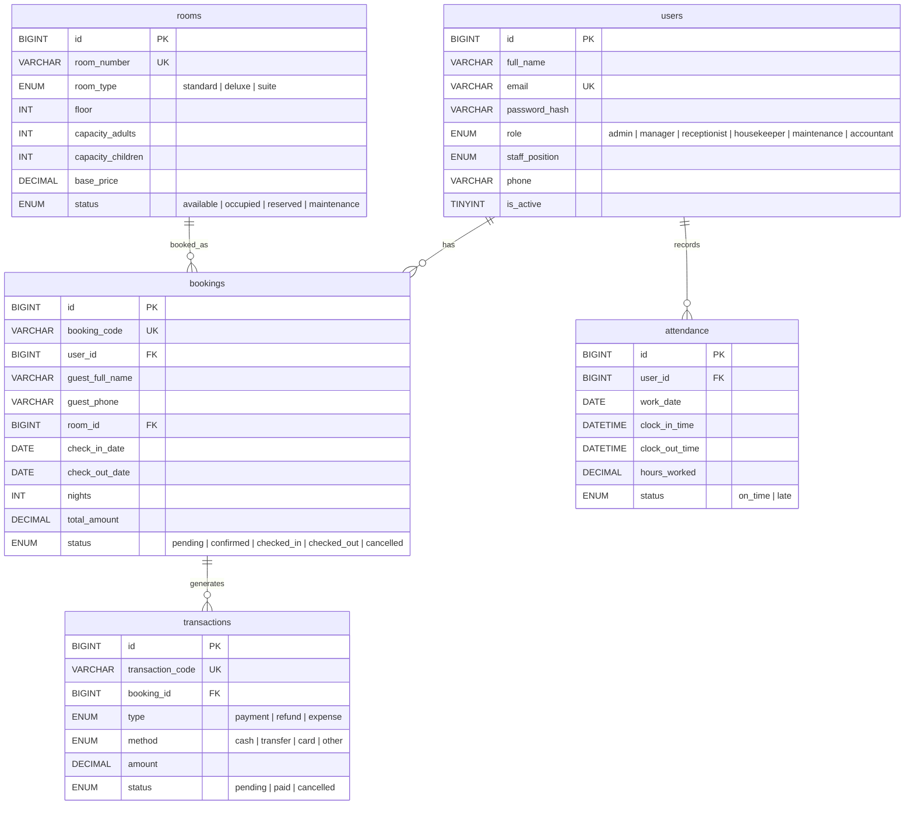

# 🏨 Hotel Management System

> ระบบบริหารจัดการโรงแรมแบบครบวงจร พัฒนาด้วย **React + Node.js + MySQL**
> รองรับการจองแบบ Guest (ไม่ต้องสมัครสมาชิก) และมีระบบสิทธิ์การเข้าถึงตามตำแหน่งงาน (RBAC)

---

## 📑 สารบัญ

- [Features](#-features)
- [Tech Stack](#-tech-stack)
- [สถาปัตยกรรมระบบ](#-สถาปัตยกรรมระบบ-architecture)
- [โครงสร้างโปรเจกต์](#-โครงสร้างโปรเจกต์)
- [Database Schema](#-database-schema)
- [API Endpoints](#-api-endpoints)
- [Role-Based Access Control](#-role-based-access-control-rbac)
- [การติดตั้งและรันโปรเจกต์](#-การติดตั้งและรันโปรเจกต์)
- [Screenshots](#-screenshots)
- [หมายเหตุ](#-หมายเหตุ)

---

## ✨ Features

### 🌐 Public (ลูกค้า / Guest)

| ฟีเจอร์ | รายละเอียด |
|---|---|
| **Customer Home** | หน้าแรกสำหรับลูกค้า แสดงข้อมูลห้องพักและช่องทางเข้าสู่ระบบพนักงาน |
| **Guest Booking** | จองห้องพักได้โดยไม่ต้องสมัครสมาชิก (2 ขั้นตอน: เลือกห้อง → กรอกข้อมูล) |
| **Booking Status** | ตรวจสอบสถานะการจองด้วย Booking Code + เบอร์โทรศัพท์ |

### 🔐 Admin / Staff (หลังเข้าสู่ระบบ)

| ฟีเจอร์ | รายละเอียด |
|---|---|
| **Dashboard** | สรุปภาพรวมโรงแรม (จำนวนห้อง, การจอง, รายได้) พร้อมกราฟ |
| **Room Management** | เพิ่ม / แก้ไข / ลบห้องพัก, จัดการประเภทห้อง (Standard, Deluxe, Suite) |
| **Room Status** | แสดงสถานะห้องแบบ Read-only (Available, Occupied, Reserved, Maintenance) |
| **Room Calendar** | ปฏิทินการจองแบบ Gantt-style เห็นภาพรวมการจองทั้งหมด |
| **Booking Management** | จัดการการจอง + เปลี่ยนสถานะ (Pending → Confirmed → Check-in → Check-out) |
| **Staff Management** | จัดการข้อมูลพนักงาน (เพิ่ม / แก้ไข / ลบ) — เฉพาะ Admin & Manager |
| **Attendance** | บันทึกเวลาเข้า-ออกงานของพนักงาน พร้อม Clock Widget |
| **Expenses** | บันทึกค่าใช้จ่ายของโรงแรม |
| **Transactions** | จัดการธุรกรรมทั้งหมด (Payment, Refund, Expense) |
| **Financial Report** | รายงานกำไร/ขาดทุน สรุปภาพรวมทางการเงิน |

---

## 🛠 Tech Stack

### Frontend (`client/`)

| เทคโนโลยี | หน้าที่ |
|---|---|
| **React 19** | UI Library |
| **TypeScript** | Type Safety |
| **Vite 7** | Build Tool & Dev Server |
| **TailwindCSS 3** | Utility-first CSS Framework |
| **React Router 7** | Client-side Routing |
| **Recharts** | กราฟ/แผนภูมิ สำหรับ Dashboard & Report |
| **Lucide React** | ไอคอน |

### Backend (`server/`)

| เทคโนโลยี | หน้าที่ |
|---|---|
| **Node.js + Express 5** | REST API Server |
| **MySQL (mysql2)** | ฐานข้อมูล |
| **JWT (jsonwebtoken)** | Authentication & Authorization |
| **bcrypt** | เข้ารหัสรหัสผ่าน |
| **dotenv** | จัดการ Environment Variables |
| **nodemon** | Auto-restart ระหว่าง Development |

---

## 🏗 สถาปัตยกรรมระบบ (Architecture)

```
┌─────────────────────┐         ┌─────────────────────┐         ┌──────────────┐
│                     │  HTTP   │                     │  SQL    │              │
│   React Frontend    │ ──────► │   Express Backend   │ ──────► │    MySQL     │
│   (Vite + TS)       │  REST   │   (Node.js)         │         │   Database   │
│   :5173             │  API    │   :3000              │         │              │
└─────────────────────┘         └─────────────────────┘         └──────────────┘
                                         │
                                    JWT Auth +
                                    RBAC Middleware
```

- **Frontend** เรียก REST API ไปยัง Backend ผ่าน HTTP
- **Backend** ใช้ JWT ในการ Authentication และ RBAC Middleware ควบคุมสิทธิ์
- **Database** เก็บข้อมูลทั้งหมดใน MySQL (`hotel_management_system`)

---

## 📁 โครงสร้างโปรเจกต์

```
testmyhotel/
├── client/                          # 🖥 Frontend (React + Vite + TypeScript)
│   ├── src/
│   │   ├── components/              # Shared Components
│   │   │   ├── AdminRoute.tsx       #   Route guard สำหรับ Admin/Manager
│   │   │   ├── ClockWidget.tsx      #   นาฬิกาเข้า-ออกงาน
│   │   │   ├── ProtectedRoute.tsx   #   Route guard สำหรับ Authenticated users
│   │   │   ├── Sidebar.tsx          #   Sidebar เมนูสำหรับ Admin Panel
│   │   │   └── StatCard.tsx         #   Card แสดงสถิติบน Dashboard
│   │   ├── layouts/
│   │   │   └── AdminLayout.tsx      # Layout หลักของหน้า Admin (Sidebar + Content)
│   │   ├── pages/
│   │   │   ├── client/              # หน้า Public สำหรับลูกค้า
│   │   │   │   ├── BookingStatus.tsx
│   │   │   │   ├── CustomerHome.tsx
│   │   │   │   ├── CustomerLogin.tsx
│   │   │   │   └── GuestBooking.tsx
│   │   │   ├── Dashboard.tsx        # หน้า Dashboard
│   │   │   ├── Booking.tsx          # จัดการการจอง
│   │   │   ├── RoomManagement.tsx   # จัดการห้องพัก
│   │   │   ├── RoomStatus.tsx       # สถานะห้อง (Read-only)
│   │   │   ├── RoomCalendar.tsx     # ปฏิทินการจอง (Gantt)
│   │   │   ├── Staff.tsx            # จัดการพนักงาน
│   │   │   ├── Attendance.tsx       # เวลาเข้า-ออกงาน
│   │   │   ├── Expenses.tsx         # ค่าใช้จ่าย
│   │   │   ├── Transactions.tsx     # ธุรกรรม
│   │   │   ├── FinancialReport.tsx  # รายงานการเงิน
│   │   │   ├── Login.tsx            # หน้าเข้าสู่ระบบพนักงาน
│   │   │   └── LandingPage.tsx      # หน้า Landing
│   │   ├── services/                # API Service Layer (Axios/Fetch)
│   │   │   ├── authService.ts
│   │   │   ├── bookingService.ts
│   │   │   ├── roomService.ts
│   │   │   ├── staffService.ts
│   │   │   ├── attendanceService.ts
│   │   │   ├── transactionService.ts
│   │   │   ├── dashboardService.ts
│   │   │   └── reportService.ts
│   │   ├── types/                   # TypeScript Type Definitions
│   │   └── utils/                   # Utility Functions
│   ├── package.json
│   ├── vite.config.ts
│   ├── tailwind.config.js
│   └── tsconfig.json
│
├── server/                          # ⚙️ Backend (Node.js + Express)
│   ├── database_schema.sql          # SQL Schema สำหรับสร้างฐานข้อมูล
│   ├── src/
│   │   ├── app.js                   # Express App Setup + Route Registration
│   │   ├── server.js                # Server Entry Point
│   │   ├── config/                  # Database Configuration
│   │   ├── middleware/
│   │   │   ├── authMiddleware.js    #   JWT Authentication
│   │   │   └── adminOnlyMiddleware.js # Admin/Manager Access Guard
│   │   ├── controllers/             # Business Logic
│   │   │   ├── authController.js
│   │   │   ├── bookingController.js
│   │   │   ├── roomController.js
│   │   │   ├── userController.js
│   │   │   ├── transactionController.js
│   │   │   ├── attendanceController.js
│   │   │   └── dashboardController.js
│   │   ├── routes/                  # API Route Definitions
│   │   │   ├── authRoutes.js
│   │   │   ├── bookingRoutes.js
│   │   │   ├── roomRoutes.js
│   │   │   ├── userRoutes.js
│   │   │   ├── transactionRoutes.js
│   │   │   ├── attendanceRoutes.js
│   │   │   ├── dashboardRoutes.js
│   │   │   ├── reportRoutes.js
│   │   │   ├── publicBookingRoutes.js
│   │   │   └── publicRoomRoutes.js
│   │   └── services/                # Service Layer
│   └── package.json
│
├── docs/
│   └── screenshots/                 # ภาพ Screenshots ของระบบ
├── .gitignore
└── README.md
```

---

## 🗄 Database Schema

ฐานข้อมูล `hotel_management_system` ประกอบด้วย **5 ตาราง** หลัก:



---

## 🔌 API Endpoints

### Public APIs (ไม่ต้อง Login)

| Method | Endpoint | รายละเอียด |
|---|---|---|
| `GET` | `/api/public/rooms` | ดูห้องว่างทั้งหมด |
| `POST` | `/api/public/bookings` | จองห้องแบบ Guest |
| `GET` | `/api/public/bookings/status` | ตรวจสอบสถานะการจอง |

### Auth APIs

| Method | Endpoint | รายละเอียด |
|---|---|---|
| `POST` | `/api/auth/login` | เข้าสู่ระบบ (รับ JWT Token) |

### Protected APIs (ต้อง Login + JWT)

| Method | Endpoint | รายละเอียด |
|---|---|---|
| `GET` | `/api/dashboard` | ดึงข้อมูล Dashboard |
| `GET/POST/PUT/DELETE` | `/api/rooms` | CRUD ห้องพัก |
| `GET/POST/PUT/DELETE` | `/api/bookings` | CRUD การจอง |
| `GET/POST/PUT/DELETE` | `/api/transactions` | CRUD ธุรกรรม |
| `GET/POST/PUT/DELETE` | `/api/users` | CRUD ผู้ใช้/พนักงาน (Admin/Manager) |
| `GET/POST/PUT` | `/api/attendance` | บันทึก/ดูเวลาเข้า-ออกงาน |
| `GET` | `/api/reports` | รายงานทางการเงิน |
| `GET` | `/health` | Health Check |

---

## 🛡 Role-Based Access Control (RBAC)

ระบบรองรับ **6 บทบาท (Roles)** แต่ละบทบาทจะเห็นเมนูและเข้าถึงฟีเจอร์ได้แตกต่างกัน:

| เมนู / ฟีเจอร์ | `admin` | `manager` | `receptionist` | `housekeeper` | `maintenance` | `accountant` |
|---|:---:|:---:|:---:|:---:|:---:|:---:|
| Dashboard | ✅ | ✅ | ✅ | ❌ | ❌ | ❌ |
| Room Management | ✅ | ✅ | ✅ | ❌ | ❌ | ❌ |
| Room Status | ✅ | ✅ | ✅ | ✅ | ✅ | ❌ |
| Room Calendar | ✅ | ✅ | ✅ | ❌ | ❌ | ❌ |
| Booking Management | ✅ | ✅ | ✅ | ❌ | ❌ | ❌ |
| Staff Management | ✅ | ✅ | ❌ | ❌ | ❌ | ❌ |
| Attendance | ✅ | ✅ | ✅ | ✅ | ✅ | ❌ |
| Expenses | ✅ | ✅ | ❌ | ❌ | ❌ | ✅ |
| Transactions | ✅ | ✅ | ❌ | ❌ | ❌ | ✅ |
| Financial Report | ✅ | ✅ | ❌ | ❌ | ❌ | ✅ |

> **สรุป:**
> - **Admin & Manager** — เข้าถึงได้ทุกเมนู
> - **Receptionist** — จัดการห้องพักและการจอง, ไม่เห็น Staff Management / Financial
> - **Housekeeper & Maintenance** — เห็นเฉพาะ Room Status + Attendance
> - **Accountant** — เห็นเฉพาะ Expenses / Transactions / Financial Report

---

## 🚀 การติดตั้งและรันโปรเจกต์

### ข้อกำหนดเบื้องต้น (Prerequisites)

- **Node.js** ≥ 18
- **MySQL** ≥ 8.0
- **npm** ≥ 9

### 1) ตั้งค่าฐานข้อมูล (Database)

```bash
# Import schema
mysql -u root -p < server/database_schema.sql
```

สร้างไฟล์ `.env` ในโฟลเดอร์ `server/`:

```env
DB_HOST=localhost
DB_USER=root
DB_PASSWORD=your_password
DB_NAME=hotel_management_system
DB_PORT=3306
JWT_SECRET=your_jwt_secret_key
PORT=3000
```

> ⚠️ **สำคัญ:** อย่าลืมอัปเดต ENUM ของ `users.role` ให้รองรับ 6 roles:
>
> ```sql
> ALTER TABLE users
> MODIFY COLUMN role ENUM(
>   'admin',
>   'manager',
>   'receptionist',
>   'housekeeper',
>   'maintenance',
>   'accountant'
> ) NOT NULL;
> ```
>
> ถ้ามีข้อมูลเก่า `role='staff'` ให้ migrate ก่อน:
>
> ```sql
> UPDATE users SET role = 'receptionist' WHERE role = 'staff';
> ```

### 2) รัน Server (Backend)

```bash
cd server
npm install
npm run dev        # Development (nodemon)
# หรือ
npm start          # Production
```

Server จะรันที่ `http://localhost:3000`

### 3) รัน Client (Frontend)

```bash
cd client
npm install
npm run dev
```

Client จะรันที่ `http://localhost:5173`

### 4) ทดสอบ

เปิดเบราว์เซอร์ไปที่ `http://localhost:5173` เพื่อเข้าสู่หน้า Customer Home

- **เข้าสู่ระบบพนักงาน:** ไปที่ `/staff/login`
- **จองห้องพัก (Guest):** ไปที่ `/book`
- **ตรวจสอบสถานะการจอง:** ไปที่ `/booking-status`

---

## 📸 Screenshots

### Public — หน้าสำหรับลูกค้า

#### Landing / Customer Home


#### Guest Booking (Step 1 — เลือกห้อง)


#### Guest Booking (Step 2 — กรอกข้อมูล)


#### Booking Status (ตรวจสอบการจอง)


---

### Admin / Staff — หน้าสำหรับพนักงาน

#### Dashboard


#### Room Status (Read-only)


#### Room Management


#### Booking Management


#### Room Calendar (Gantt-style)


#### Attendance (เข้า-ออกงาน)


#### Expenses (ค่าใช้จ่าย)


#### Transactions (ธุรกรรม)


#### Financial Report (รายงานการเงิน)


---

## 📝 หมายเหตุ

- ฝั่ง Client เรียก API ที่ `http://localhost:3000` (สามารถเปลี่ยนได้ผ่าน Service files ใน `client/src/services/`)
- ถ้าจะ Deploy จริง แนะนำให้ตั้ง `BASE_URL` เป็น **Environment Variable** แทน hardcode
- Schema SQL อยู่ที่ `server/database_schema.sql` สามารถ import ได้โดยตรง
- ระบบใช้ **JWT** เก็บไว้ใน Client side เพื่อ Authenticate ทุก API request

---

## 📄 License

ISC
