# Hotel Management System (React + Node.js + MySQL)

ระบบบริหารจัดการโรงแรมแบบครบวงจร แยกเป็นฝั่ง **Client (React + Vite + Tailwind)** และ **Server (Express + MySQL)** รองรับการจองแบบ Guest (ไม่ต้องสมัครสมาชิก) และมีระบบสิทธิ์การเข้าถึงตามตำแหน่งงาน (RBAC)

## Features

### Public (ลูกค้า)

- ดูห้องว่าง และจองห้องแบบ **Guest Booking**
- ตรวจสอบสถานะการจองด้วย **Booking Code + เบอร์โทร**
- หน้า Landing/Customer Home พร้อมทางเข้าระบบสำหรับพนักงาน

### Admin/Staff

- Dashboard สรุปภาพรวม
- จัดการห้องพัก (เพิ่ม/แก้ไข/ลบ)
- จัดการการจอง + สถานะ (เช่น Check-in/Check-out)
- Room Calendar (Gantt-style)
- Attendance เข้า-ออกงาน
- ค่าใช้จ่าย (Expenses)
- ธุรกรรม (Transactions)
- รายงานกำไร/ขาดทุน

### Role-Based Access Control (6 Roles)

รองรับ role:

- `admin`
- `manager`
- `receptionist`
- `housekeeper`
- `maintenance`
- `accountant`

ตัวอย่างสิทธิ์ (UI + เมนู):

- **Receptionist**: ไม่เห็น Staff Management / Financial Report
- **Housekeeper, Maintenance**: เห็นเฉพาะหน้า **Room Status**
- **Accountant**: เห็นเฉพาะ Expenses / Transactions / Financial Report
- **Admin, Manager**: เห็นทุกเมนู

## Tech Stack

- **Frontend**: React, TypeScript, Vite, TailwindCSS, React Router
- **Backend**: Node.js, Express, JWT
- **Database**: MySQL (mysql2)

## Project Structure

- `client/` Frontend (Vite)
- `server/` Backend (Express)

## Setup

### 1) Database

สร้างฐานข้อมูล MySQL และตั้งค่า `.env` ฝั่ง server ให้เรียบร้อย

> สำคัญ: อย่าลืมอัปเดต ENUM ของ `users.role` ให้รองรับ 6 roles

```sql
ALTER TABLE users
MODIFY COLUMN role ENUM(
  'admin',
  'manager',
  'receptionist',
  'housekeeper',
  'maintenance',
  'accountant'
) NOT NULL;
```

ถ้ามีข้อมูลเก่า `role='staff'` ให้ migrate ก่อน:

```sql
UPDATE users
SET role = 'receptionist'
WHERE role = 'staff';
```

### 2) Run Server

```bash
cd server
npm install
npm run dev
```

Server จะรันที่ `http://localhost:3000`

### 3) Run Client

```bash
cd client
npm install
npm run dev
```

Client จะรันที่ `http://localhost:5173`

## Screenshots

โครงการระบบบริหารจัดการโรงแรม (Hotel Management System)

## Screenshots (Preview)

### Admin Dashboard

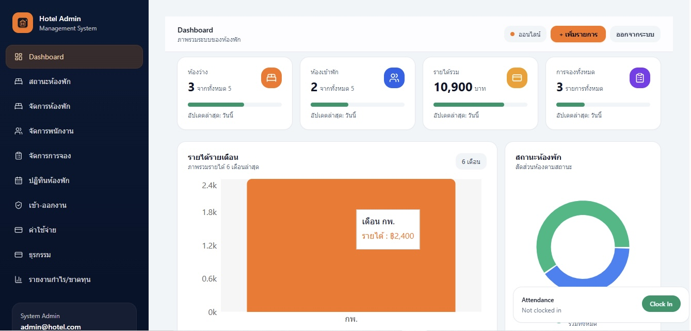

### Public Home

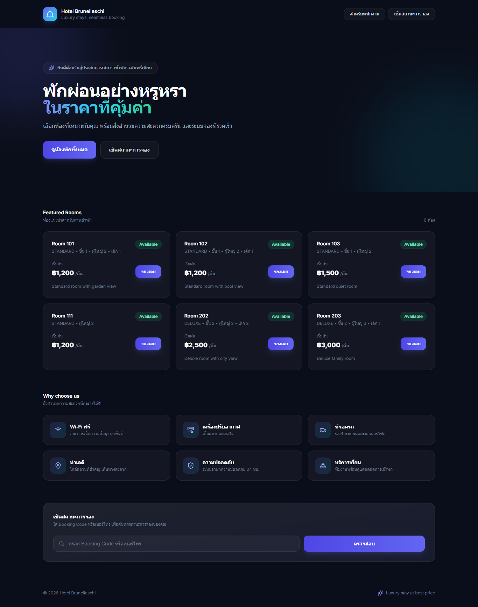

### Admin / Staff

#### Dashboard


#### Room Status (Read-only)

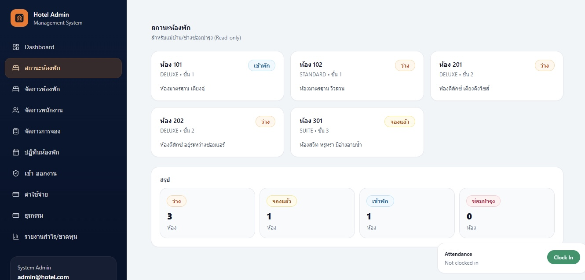

#### Room Management

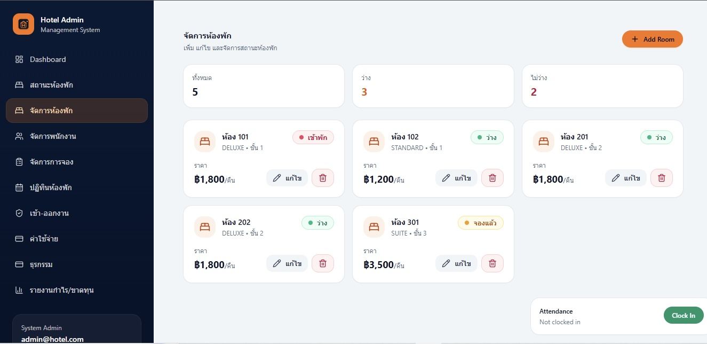

#### Booking Management

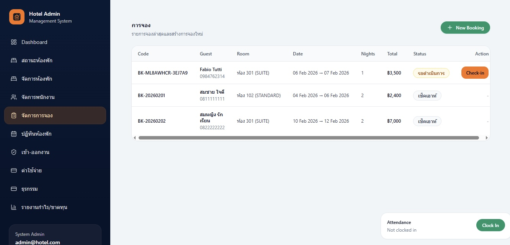

#### Room Calendar

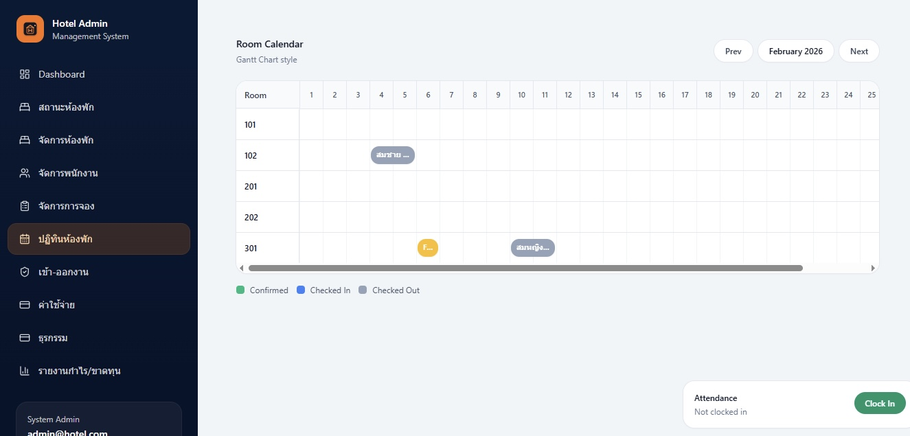

#### Attendance

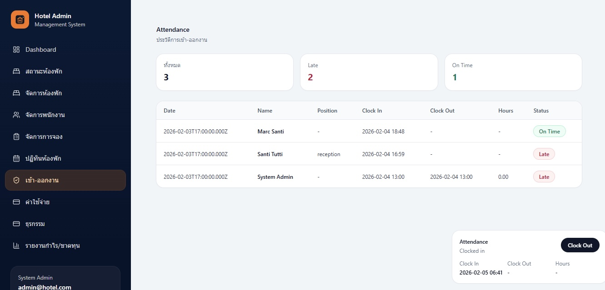

#### Expenses

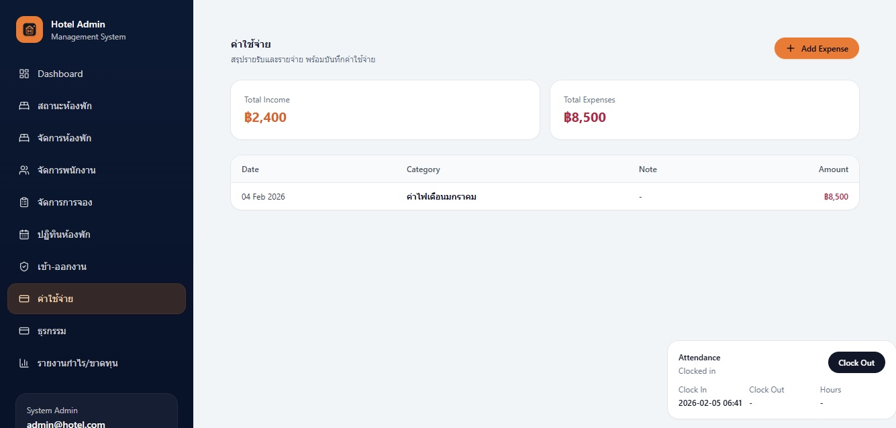

#### Transactions

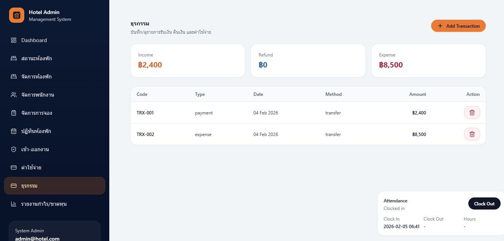

#### Financial Report

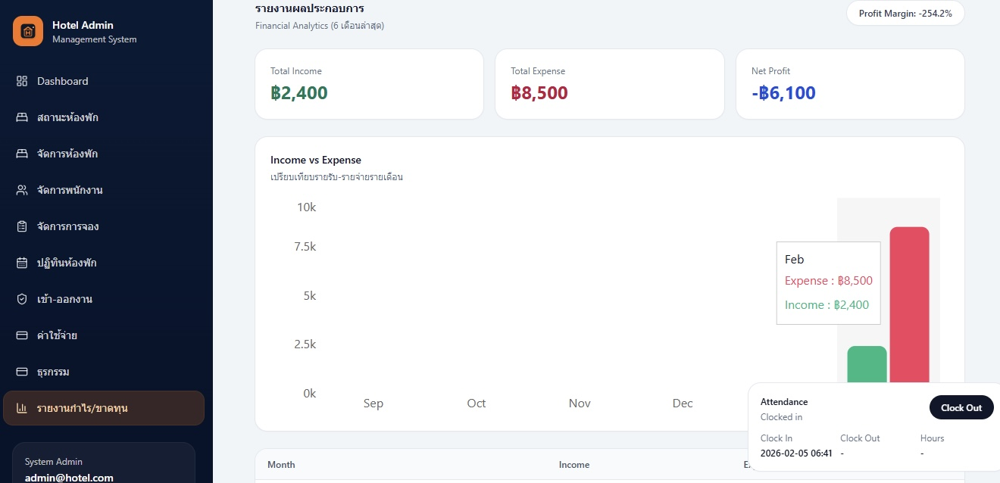

### Public

#### Landing / Customer Home


#### Booking Status

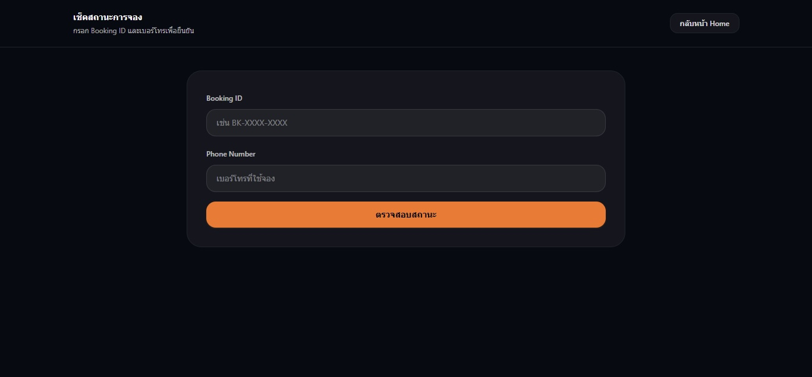

#### Guest Booking (Step 1)

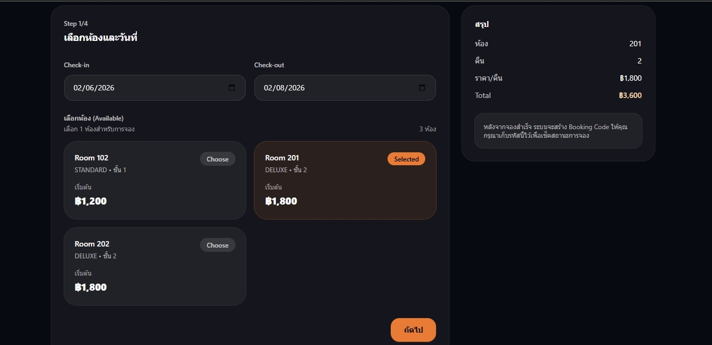

#### Guest Booking (Step 2)

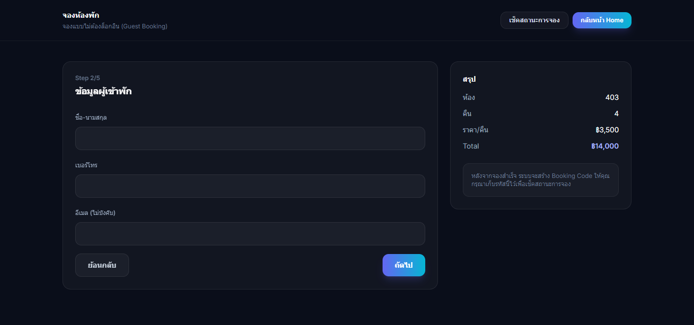

## Notes

- ฝั่ง Client เรียก API ที่ `http://localhost:3000`
- ถ้าจะ deploy จริง แนะนำให้ทำ config สำหรับ BASE_URL เป็น environment variables
